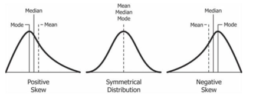
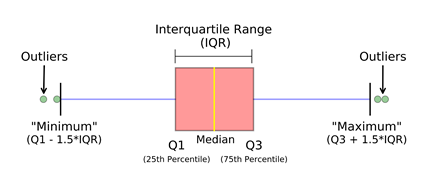
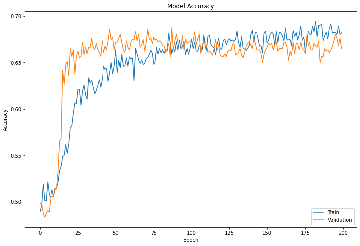
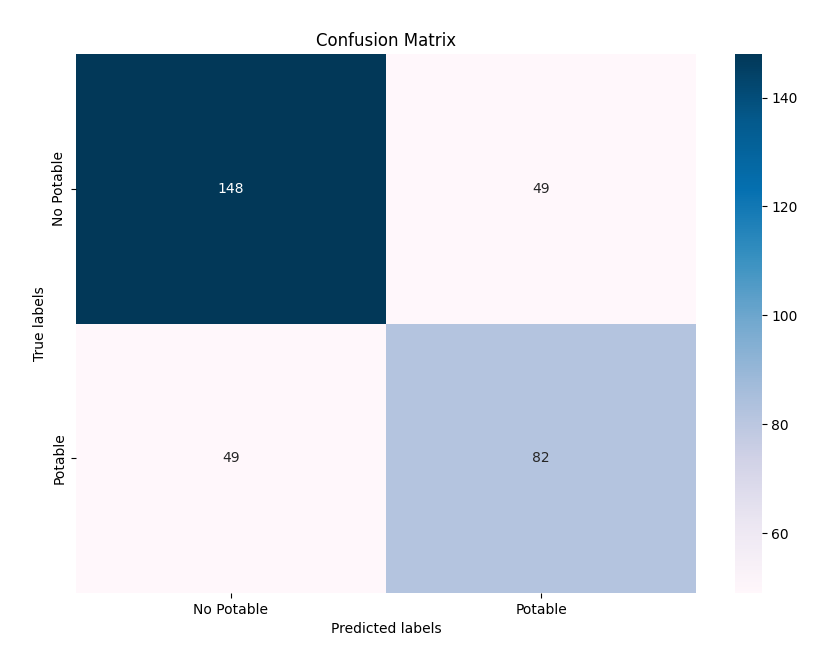

# Deep-Learning-Water-Potability
The objective of the project is to perform the classification of water quality using Deep Learning. The dataset is taken from [kaggle](https://www.kaggle.com/adityakadiwal/water-potability) and it contains the water quality metrics of 3276 water bodies.

This readme will explain the dataset structure, how the project works and the best network achieved so far.


# Index

- [Project structure](#project-structure)
- [Dataset structure](#dataset-structure)
  * [1. pH value:](#1-ph-value-)
  * [2. Hardness:](#2-hardness-)
  * [3. Solids (Total dissolved solids - TDS):](#3-solids--total-dissolved-solids---tds--)
  * [4. Chloramines:](#4-chloramines-)
  * [5. Sulfate:](#5-sulfate-)
  * [6. Conductivity:](#6-conductivity-)
  * [7. Organic_carbon:](#7-organic-carbon-)
  * [8. Trihalomethanes:](#8-trihalomethanes-)
  * [9. Turbidity:](#9-turbidity-)
  * [10. Potability:](#10-potability-)
- [How the project works](#how-the-project-works)
  * [Dataset download and import](#dataset-download-and-import)
  * [Dataset analysis](#dataset-analysis)
    + [Shape](#shape)
    + [Null Values](#null-values)
    + [Balance](#balance)
    + [Check Values](#check-values)
    + [Outliers](#outliers)
    + [Skewness](#skewness)
    + [Correlation](#correlation)
  * [Fix Null Values](#fix-null-values)
  * [Capping and Flooring outliers](#capping-and-flooring-outliers)
  * [Data Normalization](#data-normalization)
  * [Balance Dataset](#balance-dataset)
    + [Substitution](#substitution)
    + [Removal](#removal)
  * [Split data into training, validation and test set](#split-data-into-training--validation-and-test-set)
    + [Substitution](#substitution-1)
    + [Removal](#removal-1)
  * [Network structure](#network-structure)
  * [Cross-Validation Code](#cross-validation-code)
  * [Network creation](#network-creation)
    + [Options](#options)
    + [Network Creation and Training](#network-creation-and-training)
    + [Network Evaluate](#network-evaluate)
    + [Save Model](#save-model)
  * [Load Model](#load-model)
- [Test](#test)
- [Best model analysis](#best-model-analysis)
  * [Model Loss](#model-loss)
  * [Model Accuracy](#model-accuracy)
  * [Test set performance](#test-set-performance)
    + [Confusion Matrix](#confusion-matrix)
- [Consideration on the network](#consideration-on-the-network)

# Project structure
```
.
|
| Folders
├── data   # Folder with the dataset
│   └── water_potability.csv
├── network   # Folder with the network
│   └── network.zip
├── notebook  # Folder with the notebook
│   └── Water_Potability.ipynb
├── img   # Images of the graphs for the analysis report
|
| Script
├── analyze_dataset.py   # Function to analyze dataset
├── deep_learing.py   # Function to perform deep learning
├── main.py
└── variables.py   # File with the variables to configure the code
```

# Dataset structure

The ```water_potability.csv``` file contains water quality metrics for 3276 different water bodies.

## 1. pH value:
PH is an important parameter in evaluating the acid–base balance of water. It is also the indicator of acidic or alkaline condition of water status. 

WHO has recommended a maximum permissible limit of pH from 6.5 to 8.5. The current investigation ranges were 6.52–6.83 which are in the range of WHO standards.

## 2. Hardness:
Hardness is mainly caused by calcium and magnesium salts. These salts are dissolved from geologic deposits through which water travels. 

The length of time water is in contact with hardness producing material helps determine how much hardness there is in raw water. Hardness was originally defined as the capacity of water to precipitate soap caused by Calcium and Magnesium.

## 3. Solids (Total dissolved solids - TDS):
Water has the ability to dissolve a wide range of inorganic and some organic minerals or salts such as potassium, calcium, sodium, bicarbonates, chlorides, magnesium, sulfates etc. These minerals produced an unwanted taste and diluted color in the appearance of water. 

This is the important parameter for the use of water. The water with high TDS value indicates that water is highly mineralized. The Desired limit for TDS is 500 mg/l and maximum limit is 1000 mg/l which is prescribed for drinking purpose.

## 4. Chloramines:
Chlorine and chloramine are the major disinfectants used in public water systems. Chloramines are most commonly formed when ammonia is added to chlorine to treat drinking water. Chlorine levels up to 4 milligrams per liter (mg/L or 4 parts per million (ppm)) are considered safe in drinking water.

## 5. Sulfate:
Sulfates are naturally occurring substances that are found in minerals, soil, and rocks. They are present in ambient air, groundwater, plants, and food. The principal commercial use of sulfate is in the chemical industry. 

Sulfate concentration in seawater is about 2,700 milligrams per liter (mg/L). It ranges from 3 to 30 mg/L in most freshwater supplies, although much higher concentrations (1000 mg/L) are found in some geographic locations.

## 6. Conductivity:
Pure water is not a good conductor of electric current rather’s a good insulator. Increase in ions concentration enhances the electrical conductivity of water. Generally, the amount of dissolved solids in water determines the electrical conductivity. 

Electrical conductivity (EC) actually measures the ionic process of a solution that enables it to transmit current. According to WHO standards, EC value should not exceeded 400 μS/cm.

## 7. Organic_carbon:
Total Organic Carbon (TOC) in source waters comes from decaying natural organic matter (NOM) as well as synthetic sources. TOC is a measure of the total amount of carbon in organic compounds in pure water. 

According to US EPA < 2 mg/L as TOC in treated / drinking water, and < 4 mg/Lit in source water which is use for treatment.

## 8. Trihalomethanes:
THMs are chemicals which may be found in water treated with chlorine. The concentration of THMs in drinking water varies according to the level of organic material in the water, the amount of chlorine required to treat the water, and the temperature of the water that is being treated. 

THM levels up to 80 ppm is considered safe in drinking water.

## 9. Turbidity:
The turbidity of water depends on the quantity of solid matter present in the suspended state. It is a measure of light emitting properties of water and the test is used to indicate the quality of waste discharge with respect to colloidal matter. 

The mean turbidity value obtained for Wondo Genet Campus (0.98 NTU) is lower than the WHO recommended value of 5.00 NTU.

## 10. Potability:
Indicates if water is safe for human consumption where 1 means Potable and 0 means Not potable.

# How the project works

This section will show how the project works.

## Dataset download and import
In the first part of the code there will be the download of the dataset from github or from kaggle. In the second case it's important to insert in the corret folder the api token. In this [link](https://www.kaggle.com/docs/api) there's a guide on how to create a token.

Next using pandas the dataset will be inserted in a pandas dataframe.

## Dataset analysis
In the next part there will be an analysis of the dataset.

### Shape
The first thing done is to check the shape of the dataframe: **(3276,10)**

### Null Values
The second thing is to check if there are null values. 

```
ph                 491
Hardness             0
Solids               0
Chloramines          0
Sulfate            781
Conductivity         0
Organic_carbon       0
Trihalomethanes    162
Turbidity            0
Potability           0
```

Unortunately there are three columns with null values.

### Balance
Next it's important to check the balance of the dataset, because if there is a class that has more rows than the other the classification will have a good accuracy but it won't perform well on the minor class.

| Class | Number | Percentage |
|:-----:|:------:|:----------:|
|   0   |  1998  |   60.99 %  |
|   1   |  1278  |   39.01 %   |


So the dataset is unbalanced, the potability class is just 39.01%. This means that there will be a step in which using SMOTE the dataset will be balanced.

### Check Values
It is important also to check if all the data are normalized. So if the code finds some values that are bigger than 1 and lower than 0, a normalization step will be performed. 

The dataset isn't all normalized.


### Outliers
We also checked if there are many outliers using a box plot chart.


As we can see there are a lot of outliers (the points on the left and on the right of the bars).

### Skewness

Next we checked if the columns are skewed, using a distribution plot.


As we can see, many data follow the normal distribution, but there are some that are skewed, this means that the mode, median and mean won’t be on the same line.



Solids and Conductivity are the two columns that are affected by positive skewness.

The positive skewness is a problem because it means that we have a high number of data points having low values. So when we train the model it will perform better predicting low values than higher.

We can also use skewness to see the direction of the outliers. A positive skew column will have many outliers in the right side of the distribution.


### Correlation
Next we checked the correlation to see if there is some statistical relationship between the data.


We can see that there is no relationship between data.


## Fix Null Values

Next we will fix the null values of the columns: ph, sulfate and trihalomethanes. 

There are three options to fix null values:
* **mean**: If there are outliers this is not the best solution
* **median**: If there are outliers this is recommended
* **drop**: If there are few rows this could be the worse because we lose many data

```python
# solution = "mean"
solution = "median"
# solution = "drop"

if solution == "mean":
  df.ph = df.ph.fillna(df.ph.mean())
  df.Sulfate = df.Sulfate.fillna(df.Sulfate.mean())
  df.Trihalomethanes = df.Trihalomethanes.fillna(df.Trihalomethanes.mean())
elif solution == "median":
  df.ph = df.ph.fillna(df.ph.median())
  df.Sulfate = df.Sulfate.fillna(df.Sulfate.median())
  df.Trihalomethanes = df.Trihalomethanes.fillna(df.Trihalomethanes.median())
else:
  df = df.dropna()
```

At this point we can proceed in three different ways. 

In the first one the water bodies with null values aren’t removed from the dataset and each null value is replaced with the mean of the column. 

In the second one the water bodies with null values aren’t removed from the dataset and each null value is replaced with the median of the column. 

In the third case the elements with null values are dropped from the dataset. Therefore some parts of the code are different for these approaches.

By removing null values we will have a more robust and highly accurate model despite the loss of data, while substituting null values with the median we don’t remove the outliers but we don’t lose and compromise the data. 

As concerns the mean, in the dataset there are a lot of outliers, this fact affects the mean so it is not the best option.

## Capping and Flooring outliers

In this section we try to fix the outlier problem. We decided to perform the capping and flooring. 



We computed the 25th percentile and the 75th percentile, obtaining Q1 and Q3. Next we computed the [Interquartile Range (IQR)](https://en.wikipedia.org/wiki/Interquartile_range) and then we computed the “Minimum” and the “Maximum”. 

Basically when we find an outlier that is lower than the “Minimum” we change its value with the “Minimum”. The same thing applied to the “Maximum”.


## Data Normalization
In this section there will be the nomalization of the values. This process will use the ```StandardScaler()```. This scaler uses the mean and the standard deviation to set all values to between 0 and 1.

## Balance Dataset
The dataset has been balanced using [**SMOTE**](https://towardsdatascience.com/applying-smote-for-class-imbalance-with-just-a-few-lines-of-code-python-cdf603e58688) (Synthetic Minority Oversampling Technique).

The dataset will be filled with new data and it will be balanced. 

We have to distinguish two cases: the case when we substitute null values with the mean and the median and the case when we delete null values rows.

### Substitution

The new shape is **(3996,10)**

| Class | Number | Percentage |
|:-----:|:------:|:----------:|
|   0   |  1988  |    50.0 %  |
|   1   |  1988  |    50.0 %  |


Now the dataset can be used with the networks.

### Removal

The shape of the dataset without the rows with null values is **(2011,10)**.

| Class | Number | Percentage |
|:-----:|:------:|:----------:|
|   0   |  1200  |    56.97 %  |
|   1   |  811   |    40.33 %  |


With SMOTE the situation become:

| Class | Number | Percentage |
|:-----:|:------:|:----------:|
|   0   |  1200  |    50.0 %  |
|   1   |  1200  |    50.0 %  |


At this point there are two ways to proceed:
1. If we dropped the rows that contained null values we have to perform the Cross Validation.
2. If we substituted the rows that contained null values with median or mean we have just to split the dataset in training, validation and test set.

The thing that changes is the way we split the dataset.


## Split data into training, validation and test set
As we discussed in the previous paragraph there are two ways to split the training set depending on how we dealt with null values.

### Substitution

Split the data in:
* ```x_train```: The training set data
* ```y_train```: The training set label
* ```x_valid```: The validation set data
* ```y_valid```: The validation set label
* ```x_test```: The validation set data
* ```y_test```: The validation set label

The dimension will be something like

| Set | Percentage | Rows |
|:---:|:----------:|:----:|
|Training| 72 % | 2876 |
| Validation | 18 % | 720 |
| Test | 10 % | 400 |

### Removal
Since the number of elements in the dataset has decreased, we lost a lot of data. This can affect the training of our model because a low number of data could produce a bad model.

To solve this we decided to perform the cross validation. 

So we divide the dataset in test and training set. 

We split the training set in 6 parts. At every step the k<sup>a</sup> part of the training set will be the validation, while the remaining part will be the training set. 

So we train the model for each of k parts avoiding the problem of overfitting.
In the image in the next page it’s possible to see an example of cross validation using k=5.


The size will be for each iteration something like:
| Set | Percentage | Rows |
|:---:|:----------:|:----:|
|Training| 66.7 % | 1600 |
| Validation | 13.3 % | 320 |
| Test | 20 % | 480 |

## Network structure
The network we created, for each Dense layer except the last one uses **relu** as activation function. In the last Dense layer it uses the **sigmoid** activation function.
In all Dense layers in the middle of the network there is also the **l2 kernel regularizer** setted with (0.001). The optimizer used is **Adam** with the learning rate set at 0.001. The loss function used is the **binary cross entropy**.

```python
model = keras.models.Sequential()
model.add(keras.layers.Dense(64, activation='relu', input_shape=(9,)))
model.add(keras.layers.Dropout(0.5))
model.add(keras.layers.Dense(48,kernel_regularizer=keras.regularizers.l2(0.001), activation='relu'))
model.add(keras.layers.Dropout(0.5))
model.add(keras.layers.Dense(32,kernel_regularizer=keras.regularizers.l2(0.001), activation='relu'))
model.add(keras.layers.Dropout(0.5))
model.add(keras.layers.Dense(16,kernel_regularizer=keras.regularizers.l2(0.001), activation='relu'))
model.add(keras.layers.Dropout(0.5))
model.add(keras.layers.Dense(1, activation='sigmoid'))
model.compile(optimizer = keras.optimizers.Adam(learning_rate=0.001), loss='binary_crossentropy',metrics=['accuracy'])
```

In the following image it’s possible to see the structure of the network.


## Cross-Validation Code

As we discussed in previous chapters this part of code is used in the case where we removed the rows with null value. 

The network is the same as the substitution case but it’s trained with different training sets. The aim is to take the best average of the validation score from the different models trained.

The model we used in the evaluation is the model that fits better in the validation set.

```python
max_validation_score = 0
k = 6
num_samples = len(x_train) // k
validation_scores = []
for fold in range(k):
  validation_data = x_train[num_samples * fold:num_samples * (fold + 1)]
  validation_label = y_train[num_samples * fold:num_samples * (fold + 1)]
  training_data = np.concatenate((x_train[:num_samples * fold], /
  x_train[num_samples * (fold + 1):]))
  training_label = np.concatenate((y_train[:num_samples * /
  fold],y_train[num_samples * (fold + 1):]))
  model = get_model()
  history = model.fit(training_data,training_label,epochs=100, /   
  validation_data=(validation_data, validation_label))
  validation_score = model.evaluate(validation_data,validation_label)
  if validation_score[1] > max_validation_score:
    max_validation_score = validation_score[1]
    best_history = history
    best_model = model
  validation_scores.append(validation_score)

validation_score = np.average(validation_scores)
result = best_model.evaluate(x_test, y_test)
```

But this is not the best solution that we found.


## Network creation

Here there are two options:
1. Create a new model
2. Load a model
With the first option we need to create a model and train it. While with the other we can just import the model and test it.

### Network Evaluate
In this section there is the network evaluation. The code will plot useful data to understand how well the model is made and how it performs on the test set.
The plots will be:
* The model loss graph
* The model accuracy graph
* The performance of the test set using the balanced dataset
* The confusion matrix using the balanced dataset
* The performance of the test set using the original dataset
* The confusion matrix using the original dataset

### Save Model
In the code there is also the possibility to save the created model. In the ```variables.py``` it is possible to choose the name. The model will be a folder in the network folder.


# Test

The code we wrote can be configured in different ways, there are many variables that enable or disable parts of the code.

The things that can be configured are:
* How to deal with null values
* Choose whether to perform capping and flooring of the outliers
* Depending on how the null values were managed, whether to perform the cross validation or not

In the following table it’s possible to see every type of test we did with the range of results obtained. We won’t show every test, but we will discuss just the best model we found so far.

|Null Values Management|Capping / Flooring?|Training Method|Accuracy Range|
|:-:|:-:|:-:|:-:|
|Substitute Mean|No|Normal|63-66%|
|Substitute Mean|Yes|Normal|63-68%|
|Substitute Median|No|Normal|63-70%|
|Substitute Median|Yes|Normal|63-68%|
|Drop Rows|No|Cross Validation|64-66%|
|Drop Rows|Yes|Cross Validation|63-68%|

# Best model analysis
In this section we will analyze the best model that we achieved. This is the best model achieved in terms of accuracy. This model uses the median to substitute the null values.

## Model Loss


As we can see there are some spikes in the Validation but overall it follows the Training loss. So there is no underfitting and no overfitting.

## Model Accuracy



As we can see there are some spikes in the accuracy and as we can see there's a little overfitting. 

## Test set with SMOTE performance

In this section we will see how well the network perform on the training set.

| Accuracy | Loss |
|:--------:|:----:|
| 70.50 % | 0.5884 |


| Class | Precision | Recall | f1-score | support |
|:-----:|:---------:|:------:|:--------:|:-------:|
| 0 | 0.72 | 0.68 | 0.70 | 203 |
| 1 | 0.69 | 0.73 | 0.71 | 197 |

As we can see the results aren’t so good. We have low accuracy on the test set and even on the validation set.

### Confusion Matrix



As we can see there are many false negatives and false positives.

## Test set without SMOTE performance

In this section we will see how well the network perform on the training set.

| Accuracy | Loss |
|:--------:|:----:|
| 68.0 % | 0.5675 |


| Class | Precision | Recall | f1-score | support |
|:-----:|:---------:|:------:|:--------:|:-------:|
| 0 | 0.77 | 0.70 | 0.75 | 206 |
| 1 | 0.56 | 0.65 | 0.60 | 122 |

In general the performance is bad, without the dataset balanced the situation is still bad and also worse, mostly for the class with few elements.

### Confusion Matrix


As we can see there are many false negatives and false positives.

# Consideration on the network
The dataset is skewed and has a lot of outliers. This creates a lot of problems in fact the best model achieved so far has an accuracy of 70.50%. 

In general when we run the script the mean accuracy of the model is between 63% and 68%. 

# How to run the project
Here we will explain how to run the code. It’s important to have python installed

1. Clone the repository
```bash
git clone https://github.com/thisispivi/Deep-Learning-Water-Potability.git
```

2. Run these lines on a terminal
```bash
pip install sklearn
pip install imblearn
pip install pandas
pip install matplotlib
pip install tensorflow
pip install seaborn
```

3. Open the ```variables.py``` file and configure the variables:
* **train_model** -> True: the network will be trained / False: network won't' be trained
* **model_loss** -> True: plot the model loss / False: don't plot the model loss
* **model_accuracy** -> True: plot the model accuracy / False: don't plot the model accuracy
* **evaluate_model** -> True: evaluate the model / False: don't evaluate the model
* **conf_matr** -> True: plot the confusion matrix / False: don't plot the confusion matrix
vplot_model** -> True: plot the structure of the network / False: don't plot the structure of the network
* **save_model** -> True: save the model / False: don't save the model
* **load_model** -> True: load a model in the network folder / False: don't load the model

4. Choose how to deal with null values by uncommenting one of the rows:
```python
# solution = "mean"
solution = "median"
# solution = "drop"
```

5. Choose if to remove outliers by putting the variable to True or False
```python
substitute = True
```

6. Run the code:
```bash
python main.py
```

## Load the model
To load our trained model:

1. Go the network folder and unzip the model.zip file

2. Open the ```variables.py``` file and change the ```load_model``` variable to **True**

3. Run the code:
```bash
python main.py
```
